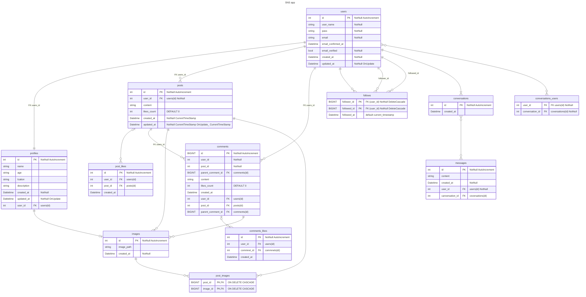

```mermaid
---
title: SNS app
---
erDiagram
    users {
        int id PK "NotNull AutoIncrement"
        string user_name "NotNull"
        string pass "NotNull"
        string email "NotNull"
        Datetime email_confirmed_at 
        bool email_verified "NotNull"
        Datetime created_at "NotNull"
        Datetime updated_at "NotNull OnUpdate"
    }

    users ||--|| profiles: "FK users_id"
    profiles {
        int id PK "NotNull AutoIncrement"
        string name
        string age
        string lcation
        string description
        Dattetime created_at "NotNull"
        Dattetime updated_at "NotNull OnUpdate"
        int user_id FK "users(id)"
    }

    users ||--o{ posts: "FK users_id"
    posts {
        int id PK "NotNull AutoIncrement"
        int user_id FK "users(id) NotNull"
        string content
        int likes_count "DEFAULT 0"
        Datetime created_at "NotNull CurrentTimeStamp"
        Datetime apdated_at "NotNull CurrentTimeStamp OnUpdate_ CurrentTimeStamp"
    }

    posts |o--o{ post_likes: ""
    post_likes {
        int id PK "NotNull AutoIncrement"
        int user_id FK "users(id)"
        int post_id FK "posts(id)"
        Datetime created_at
    }

    users ||--o{ comments: "FK users_id"
    posts ||--o{ comments: "FK users_id"
    comments {
        BIGINT id PK "NotNull AutoIncrement"
        int user_id "NotNull"
        int post_id "NotNull"
        BIGINT parent_comment_id FK "comments(id)"
        string content
        int likes_count "DEFAULT 0"
        Datetime created_at
        int user_id FK "users(id)"
        int post_id FK "posts(id)"
        BIGINT parent_comment_id FK "comments(id)"
    }

    comments |o--o{ comments_likes: ""
    comments_likes {
        int id PK "NotNull AutoIncrement"
        int user_id FK "users(id)"
        int commnet_id FK "commnets(id)"
        Datetime created_at
    }

    users||--o{ follows: ""
    users ||--o{ follows : "follower_id"
    users ||--o{ follows : "followed_id"
    follows {
        BIGINT follower_id PK "FK (user_id) NotNull DeleteCascade"
        BIGINT followed_id PK "FK (uuer_id) NotNull DeleteCascade"
        Datetime followed_at "default current_timestamp"
    }

    users ||--|{ conversations: ""
    %% DMで使用
    conversations {
        int id PK "NotNull AutoIncrement"
        Datetime created_at 
    }

    users }o--o{ conversations_users :""
    %% DMで使用
    conversations_users {
        int user_id FK "FK users(id) NotNull "
        int conversation_id FK "coversations(id) NotNull "
    }

    conversations }o--o{ messages : ""
    %% DMで使用
    messages {
        int id PK "NotNull AutoIncrement"
        string content
        Datetime created_at "NotNull"
        int user_id FK "users(id) NotNull"
        int canversation_id FK "coversations(id)"
    }

    profiles ||--o| images: ""
    posts ||--o{ images: ""
    comments ||--o{ images: ""
    images {
        int id PK "NotNull AutoIncrement"
        string image_path 
        Datetime created_at "NotNull"
    }

    posts ||--o{ post_images :""
    images ||--o{ post_images :"" 
    post_images{
        BIGINT post_id PK, FK "ON DELETE CASCADE"
        BIGINT image_id  PK, FK  "ON DELETE CASCADE"
    }


```