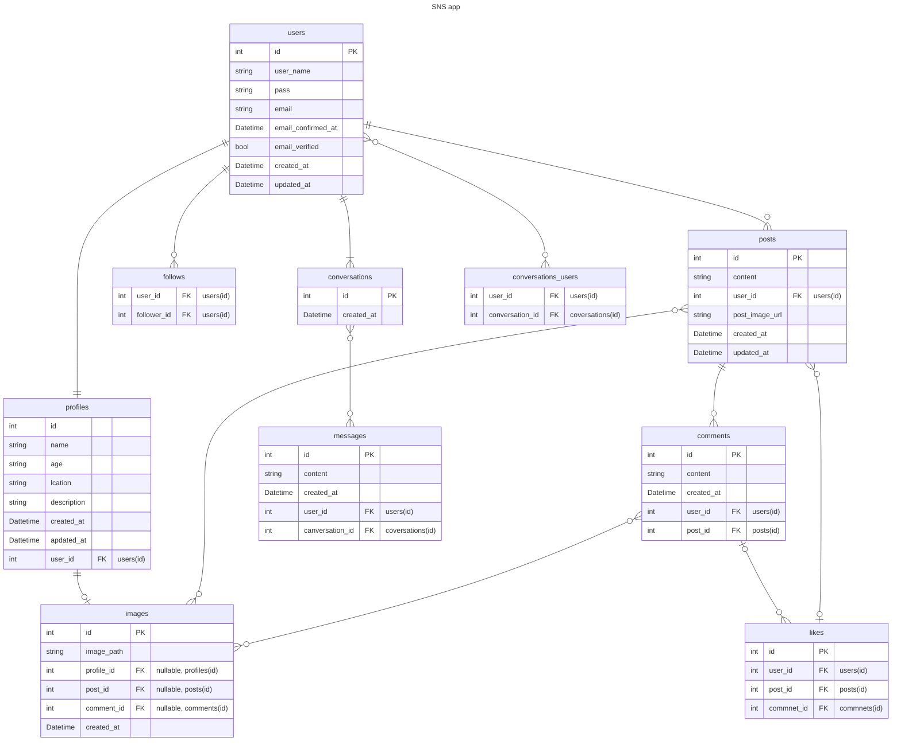

```mermaid
---
title: SNS app
---
erDiagram

    users {
        int id PK
        string user_name
        string pass
        string email
        Datetime email_confirmed_at
        bool email_verified
        Datetime created_at
        Datetime updated_at
    }

    users ||--|| profiles: ""
    profiles {
        int id
        string name
        string age
        string lcation
        string description
        Dattetime created_at
        Dattetime apdated_at 
        int user_id FK "users(id)"
    }

    users ||--o{ posts: ""
    likes |o--o{ posts: ""
    posts {
        int id PK
        string content
        int user_id FK "users(id)"
        string post_image_url 
        Datetime created_at
        Datetime updated_at
    }

    posts ||--o{ comments: ""
    comments |o--o{ likes: ""
    comments {
        int id PK
        string content
        Datetime created_at
        int user_id FK "users(id)"
        int post_id FK "posts(id)"
    }

    likes {
        int id PK 
        int user_id FK "users(id)"
        int post_id FK "posts(id)"
        int commnet_id FK "commnets(id)"
    }

    users||--o{ follows: ""
    follows {
        int user_id FK "users(id)"
        int follower_id FK "users(id)"
    }

    users ||--|{ conversations: ""
    conversations {
        int id PK
        Datetime created_at
    }

    users }o--o{ conversations_users :""
    conversations_users {
        int user_id FK "users(id)"
        int conversation_id FK "coversations(id)"
    }

    conversations }o--o{ messages : ""
    messages {
        int id PK
        string content
        Datetime created_at
        int user_id FK "users(id)"
        int canversation_id FK "coversations(id)"
    }

    profiles ||--o| images: ""
    posts }o--o{ images: ""
    comments }o--o{ images: ""
    images {
        int id PK
        string image_path
        int profile_id FK  "nullable,  profiles(id)" 
        int post_id FK "nullable, posts(id)"
        int comment_id FK "nullable, comments(id)"
        Datetime created_at
    }


```